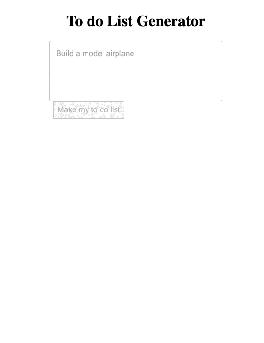

# GPT-Todo - NestJS and Vite App

Welcome to GPT-Todo! I made this as a joke because the start-up [Strongsuit](https://www.crunchbase.com/organization/speedwell-yarrow) got $3 Million in VC funding for a [basic todo app](https://www.youtube.com/shorts/tCtz3i6y59I). This is a Todo list application built with NestJS for the backend API and Vite for the frontend. It uses Chat GPT to generate the todo list. This app utilizes Yarn workspaces for efficient dependency management and better code organization.

I can't host an example of this application because Chat GPT does not handle GDPR at all.



## Prerequisites

Before getting started, please ensure you have the following software installed:

- [Node.js](https://nodejs.org/) v19.0.0 or higher
- [Yarn](https://yarnpkg.com/) v1.22.0 or higher

## OpenAI API Key

In order to use the OpenAI features in this application, you need to obtain an API key from OpenAI.

1. Visit [https://platform.openai.com/account/api-keys](https://platform.openai.com/account/api-keys) to get your API key.
2. Locate the environment file at `apps/api/.env`.
3. Add your OpenAI API key to the `.env` file like so:

```
OPENAI_API_KEY=your_api_key_here
```

Replace `your_api_key_here` with the API key you obtained from the OpenAI platform.

## Installation

To install the necessary dependencies, run the following command from the root directory of the project:

```bash
yarn install
```

This command installs all the dependencies required for both the frontend and backend.

## Building the Application

To build the application, run the following command:

```bash
yarn run build
```

## Running the Application

To run the application, you will need to start both the API and frontend development servers. Open two separate terminal windows or tabs and follow the instructions below:

### Terminal 1 - Backend API

To start the backend API in development mode, run the following command:

```bash
yarn workspace @gpt-todo/api start:dev
```

This command starts the API on the default port (usually 3000).

### Terminal 2 - Frontend

To start the frontend development server, run the following command:

```bash
yarn workspace @gpt-todo/front-end dev
```

This command starts the frontend development server on the default port (usually 3001).

## Usage

Once both the API and frontend servers are running, open a web browser and navigate to http://localhost:3001 to access the Todo list application.

Start adding, editing, and deleting todos to see the application in action.

## Contributing

Contributions are welcome! If you find any bugs, please open an issue on the GitHub repository. If you have any feature suggestions or improvements, feel free to submit a pull request.

## License

This project is licensed under the MIT License. See the LICENSE file for more details.
